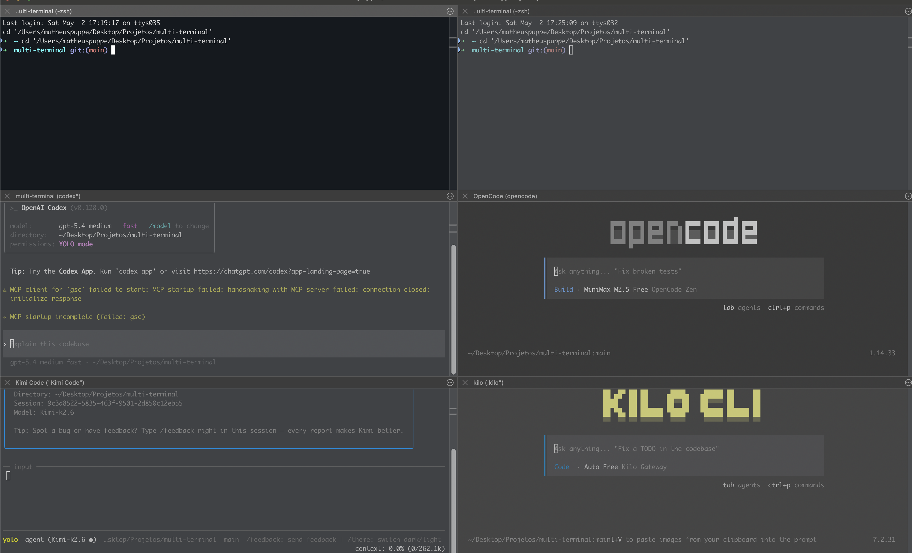

# multi-terminal

CLI em Rust para abrir múltiplos panes de terminal com agentes de IA e comandos customizáveis.

## Preview



## O que faz

- Layout padrão: `grid` com 6 panes
- Suporta layouts dinâmicos:
  - `grid`
  - `main-left`
  - `main-top`
- Aceita quantidade variável de panes com `--panes`
- Inicia, por padrão (6 panes em grid):
  - pane 1: shell livre
  - pane 2: `codex --yolo`
  - pane 3: `kimi --yolo`
  - pane 4: shell livre
  - pane 5: `opencode`
  - pane 6: `kilo`
- Permite sobrescrever comando e título por índice
- Permite persistir defaults globais via CLI com `--set-default`
- Permite salvar layouts nomeados e recarregá-los depois
- Mantém compatibilidade com `--layout a` e `--layout b`

## Estratégia de execução

- No macOS:
  - usa `iTerm2` quando disponível
  - ao maximizar, tenta abrir a nova janela na mesma tela da janela de terminal que chamou o comando
  - tenta instalar `iTerm2` automaticamente via Homebrew quando não estiver instalado
- Fora disso, ou se o fluxo do `iTerm2` falhar:
  - usa `tmux` quando disponível
  - cai para um fallback TUI em Rust com `portable-pty` + `crossterm`

O terminal precisa ter no mínimo `80x24` apenas quando a execução cair para `tmux` ou para o TUI fallback.

## Instalação

### Rodando localmente

```bash
cargo run
cargo run -- --layout-type grid --panes 6
```

### Binário compilado

```bash
./target/debug/multi-terminal
./target/debug/multi-terminal --layout-type main-left --panes 5
```

### Instalação global

```bash
cargo install --path . --force
```

Depois:

```bash
multi-terminal
multi-terminal --layout-type main-top --panes 7
multi-terminal ~/projetos/minha-pasta
multi-terminal --close-current
multi-terminal --force-close-current
```

Atalho local do repositório:

```bash
./install
```

O script `./install` também tenta criar o atalho `mt` em `~/.cargo/bin/mt`, apontando para `multi-terminal`.
Se esse caminho já estiver ocupado por outro comando, o script preserva o comando existente e mantém apenas `multi-terminal`.

Depois:

```bash
mt
mt --layout-type main-top --panes 7
mt ~/projetos/minha-pasta
mt --cc
mt --fcc
```

Você também pode passar uma pasta como argumento posicional. O `multi-terminal` troca para esse diretório antes de abrir os panes, então todos eles começam naquela pasta.

Se o binário global estiver desatualizado no `PATH`, reinstale com `cargo install --path . --force`.
Um sintoma típico é `multi-terminal --help` mostrar apenas `--layout` e não listar `--layout-type`.

## Uso básico

```bash
multi-terminal
multi-terminal ~/projetos/api
multi-terminal --layout-type grid --panes 6
multi-terminal ~/projetos/api --layout-type grid --panes 6
multi-terminal --layout-type main-left --panes 5 --maximize
multi-terminal --close-current
multi-terminal --force-close-current
multi-terminal --set-default --layout-type grid --panes 5 --pane 2="npm run dev"
```

## Flags principais

### Layout dinâmico

```bash
multi-terminal --layout-type grid --panes 6
multi-terminal --layout-type main-left --panes 5
multi-terminal --layout-type main-top --panes 7
```

`--panes` exige `--layout-type`.

### Sobrescrever panes por índice

Os panes são indexados a partir de `1`.

```bash
multi-terminal \
  --layout-type grid \
  --panes 6 \
  --pane 2="npm run dev" \
  --pane 5="htop" \
  --title 2=App \
  --title 5=Monitor
```

Se `--pane INDEX=...` for usado sem `--title INDEX=...`, o próprio comando vira o título padrão daquele pane.

### Desabilitar agentes padrão

```bash
multi-terminal --no-codex
multi-terminal --no-opencode
multi-terminal --no-codex --no-opencode
```

Essas flags substituem o pane correspondente por shell livre:
- `--no-codex` desabilita o pane 2
- `--no-opencode` desabilita o pane 5

As flags legadas `--no-claude` e `--no-cursor` também continuam aceitas e afetam os panes 2 e 4 respectivamente.

### Fechar o terminal atual

```bash
multi-terminal --close-current
mt --cc
```

`--cc` é alias de `--close-current`. A flag só fecha o terminal atual quando o `multi-terminal` consegue abrir a nova janela em um app separado.

```bash
multi-terminal --force-close-current
mt --fcc
```

`--fcc` é alias de `--force-close-current`. Essa variante tenta encerrar a sessão atual sem prompt antes de fechar a janela.

### Persistir defaults globais

Use `--set-default` para salvar o layout padrão usado quando `multi-terminal` roda sem `--load`, `--layout` ou `--layout-type`.

```bash
multi-terminal \
  --set-default \
  --layout-type grid \
  --panes 5 \
  --pane 2="npm run dev" \
  --title 2=App \
  --pane 5="opencode" \
  --title 5=OpenCode
```

Precedência da configuração:

- flags da execução atual
- layout carregado com `--load`
- default persistido com `--set-default`
- defaults hardcoded do app

## Layouts salvos

Salvar uma configuração dinâmica:

```bash
multi-terminal \
  --layout-type main-left \
  --panes 5 \
  --pane 2="npm run dev" \
  --title 2=App \
  --save team
```

Listar layouts salvos:

```bash
multi-terminal --list-layouts
```

Carregar um layout salvo:

```bash
multi-terminal --load team
```

Overrides via CLI continuam valendo ao carregar um layout salvo:

```bash
multi-terminal --load team --pane 5=lazygit --title 5=Git
```

Os layouts são persistidos no diretório de configuração do sistema em `multi-terminal/layouts.json`.

O default global é persistido separadamente em `multi-terminal/default.json`.

## Compatibilidade legada

Os layouts antigos ainda funcionam:

```bash
multi-terminal --layout a
multi-terminal --layout b
```

Os flags legados `--pane1` a `--pane4` e `--title1` a `--title4` continuam aceitos para o modo legado e para os quatro primeiros panes.

## Desenvolvimento

```bash
cargo fmt --all
cargo clippy --all-targets --all-features -- -D warnings
cargo test
```

## Pre-commit hook

Ative o hook versionado deste repositório:

```bash
git config core.hooksPath .githooks
```

Depois disso, cada `git commit` vai executar:

```bash
cargo fmt --all --check
cargo clippy --all-targets --all-features -- -D warnings
cargo test
```
